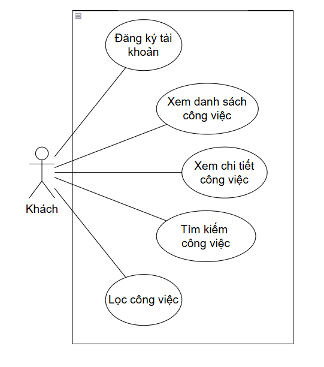

# Job Portal Design & Docs

## Use Case Diagram

## Class Diagram

## Use Case Description

### UC 1.1 Use case đăng ký tài khoản

| Field             | Value                                                    |
| ----------------- | -------------------------------------------------------- |
| Use Case ID       | UC-1.1                                                   |
| Use Case Name     | Đăng ký tài khoản                                        |
| Actor(s)          | Khách                                                    |
| Short Description | Cho phép Actors đăng ký tài khoản mới                    |
| Pre-Conditions    | Actors sở hữu một tài khoản email                        |
| Post-Conditions   | Actors đăng ký thành công tài khoản khách                |

#### Main Flow

1. Tại trang bắt đầu, Actors nhấn vào nút “Đăng ký”
2. Actors điền thông tin vào các trường thông tin trống
3. Actors nhấn chọn nút chấp nhận các điều khoản
4. Actors nhấn nút "Đăng ký"
5. Hệ thống chuyển hướng người dùng đến trang xác thực tài khoản
6. Actors nhập mã và nhấn “Xác nhận”
7. Hệ thống chuyển hướng người dùng đến trang đăng nhập

### UC 1.2 Use case đăng nhập

| Field             | Value                                                    |
| ----------------- | -------------------------------------------------------- |
| Use Case ID       | UC-1.2                                                   |
| Use Case Name     | Đăng nhập                                                |
| Actor(s)          | Ứng viên, Nhà tuyển dụng, Quản trị viên                  |
| Short Description | Cho phép Actors đăng nhập vào ứng dụng                   |
| Pre-Conditions    | Actors sở hữu tài khoản trong hệ thống                   |
| Post-Conditions   | Actors đăng nhập thành công vào ứng dụng                 |

#### Main Flow

1. Tại trang bắt đầu, Actors nhấn vào nút “Đăng nhập”
2. Actors điền email và mật khẩu
3. Actors nhấn nút "Đăng nhập"
4. Hệ thống chuyển hướng đến trang chủ ứng dụng

### UC 1.3 Use case đổi mật khẩu

| Field             | Value                                                    |
| ----------------- | -------------------------------------------------------- |
| Use Case ID       | UC-1.3                                                   |
| Use Case Name     | Đổi mật khẩu                                             |
| Actor(s)          | Ứng viên, Nhà tuyển dụng, Quản trị viên                  |
| Short Description | Cho phép Actors tạo mật khẩu mới                         |
| Pre-Conditions    | Actors sở hữu tài khoản trong hệ thống                   |
| Post-Conditions   | Actors tạo thành công mật khẩu mới                       |

#### Main Flow

1. Tại trang chủ, Actors nhấn vào biểu tượng tài khoản
2. Nhấn “Đổi mật khẩu”
3. Hệ thống chuyển hướng đến trang Đổi mật khẩu
4. Actors nhập các trường thông tin
5. Nhấn “Lưu”
6. Hệ thống thông báo “Lưu mật khẩu thành công” và chuyển người dùng về lại trang Đăng nhập

### UC 1.4 Use case quên mật khẩu

| Field             | Value                                                    |
| ----------------- | -------------------------------------------------------- |
| Use Case ID       | UC-1.4                                                   |
| Use Case Name     | Quên mật khẩu                                            |
| Actor(s)          | Ứng viên, Nhà tuyển dụng, Quản trị viên                  |
| Short Description | Cho phép Actors tạo mật khẩu mới khi quên mật khẩu       |
| Pre-Conditions    | Actors sở hữu tài khoản trong hệ thống                   |
| Post-Conditions   | Actors tạo thành công mật khẩu mới                       |

#### Main Flow

1. Tại trang đăng nhập, Actors nhấn vào nút “Quên mật khẩu?”
2. Actors điền email và nhấn “Tạo lại mật khẩu”
3. Người dùng nhập mã được gửi vào email
4. Người dùng điền vào các trường thông tin còn thiếu
5. Người dùng nhấn “Cập nhật mật khẩu”
6. Hệ thống thông báo “Cập nhật mật khẩu thành công” và chuyển hướng đến trang đăng nhập

### UC 1.5 Use case đổi ảnh đại diện

| Field             | Value                                                    |
| ----------------- | -------------------------------------------------------- |
| Use Case ID       | UC-1.5                                                   |
| Use Case Name     | Đổi ảnh đại diện                                         |
| Actor(s)          | Ứng viên                                                 |
| Short Description | Cho phép Actors đổi ảnh đại diện của tài khoản           |
| Pre-Conditions    | Tài khoản Actors đã được đăng nhập thành công            |
| Post-Conditions   | Actors đổi ảnh đại diện mới thành công                   |

#### Main Flow

1. Tại trang chủ, Actors nhấn vào biểu tượng tab “Tài khoản”
2. Hệ thống sổ ra 3 lựa chọn là “Thông tin cá nhân”, “Đổi mật khẩu” và “Đăng xuất” và biểu tượng camera dưới ảnh đại diện
3. Actors nhấn vào biểu tượng camera
4. Hệ thống yêu cầu quyền truy cập thư viện ảnh
5. Actors chọn ảnh muốn đổi
6. Hệ thống đổi ảnh đại diện cho tài khoản

### UC 1.6 Use case thay đổi thông tin tài khoản

| Field             | Value                                                    |
| ----------------- | -------------------------------------------------------- |
| Use Case ID       | UC-1.6                                                   |
| Use Case Name     | Thay đổi thông tin tài khoản                             |
| Actor(s)          | Ứng viên, Nhà tuyển dụng                                 |
| Short Description | Cho phép Actors thay đổi thông tin tài khoản             |
| Pre-Conditions    | Tài khoản Actors đã được đăng nhập thành công            |
| Post-Conditions   | Actors thay đổi thông tin tài khoản thành công           |

#### Main Flow

1. Tại trang chủ, Actors nhấn vào biểu tượng tài khoản
2. Hệ thống sổ ra 3 lựa chọn là “Thông tin cá nhân”, “Đổi mật khẩu” và “Đăng xuất”
3. Actors nhấn vào nút “Thông tin cá nhân”
4. Hệ thống chuyển hướng đến trang thông tin tài khoản bao gồm các nút “Hủy”, “Lưu” và các trường thông tin như:Email,  Họ và Tên, Địa chỉ,...
5. Actors chỉnh sửa thì các trường thông tin (trừ email)
6. Actors ấn nút "Lưu"
7. Hệ thống hiển thị thông báo “Cập nhật thông tin thành công”
8. Hệ thống điều hướng Actors về trang Tài khoản

### UC 1.7 Use case đăng xuất

| Field             | Value                                                    |
| ----------------- | -------------------------------------------------------- |
| Use Case ID       | UC-1.7                                                   |
| Use Case Name     | Đăng xuất                                                |
| Actor(s)          | Ứng viên, Nhà tuyển dụng, Quản trị viên                  |
| Short Description | Cho phép Actors đăng xuất khỏi ứng dụng                  |
| Pre-Conditions    | Tài khoản Actors đã được đăng nhập thành công            |
| Post-Conditions   | Actors đăng xuất khỏi thành công khỏi ứng dụng           |

#### Main Flow

1. Tại trang chủ, Actors nhấn vào biểu tượng tài khoản
2. Actors nhấn vào nút “Đăng xuất”
3. Hệ thống tiến hành đăng xuất tài khoản khỏi hệ thống
4. Hệ thống thông báo đăng xuất thành công
5. Hệ thống điều hướng Actors đến trang chủ

### UC 1.8 Use case xem danh sách công việc

| Field             | Value                                                    |
| ----------------- | -------------------------------------------------------- |
| Use Case ID       | UC-1.8                                                   |
| Use Case Name     | Xem danh sách công việc                                  |
| Actor(s)          | Khách, Ứng viên                                          |
| Short Description | Cho phép Actors xem danh sách công việc                  |
| Pre-Conditions    |                                                          |
| Post-Conditions   | Actors xem danh sách công việc thành công                |

#### Main Flow

1. Actors chọn mục “Trang chủ” tại thanh điều hướng
2. Hệ thống chuyển hướng Actors đến trang chủ để xem danh sách công việc

### UC 1.9 Use case tìm kiếm công việc

| Field             | Value                                                    |
| ----------------- | -------------------------------------------------------- |
| Use Case ID       | UC-1.9                                                   |
| Use Case Name     | Tìm kiếm công việc                                       |
| Actor(s)          | Khách, Ứng viên                                          |
| Short Description | Cho phép Actors tìm kiếm được công việc mong muốn        |
| Pre-Conditions    |                                                          |
| Post-Conditions   | Actors tìm kiếm công việc thành công                     |

#### Main Flow

1. Tại trang chủ, Actors chọn vào thanh tìm kiếm phía trên màn hình
2. Actors nhập vào thông tin cần tìm
3. Hệ thống lọc những thông tin theo yêu cầu của người dùng và hiển thị trên trang chủ

### UC 1.10 Use case lọc công việc

| Field             | Value                                                    |
| ----------------- | -------------------------------------------------------- |
| Use Case ID       | UC-1.10                                                  |
| Use Case Name     | Lọc công việc                                            |
| Actor(s)          | Khách, Ứng viên                                          |
| Short Description | Cho phép Actors lọc công việc                            |
| Pre-Conditions    |                                                          |
| Post-Conditions   | Actors lọc công việc thành công                          |

#### Main Flow

1. Actors chọn vào “Tất cả công việc” tại trang chủ
2. Hệ thống chuyển hướng người dùng đến trang hiển thị tất cả công việc
3. Actors lọc công việc theo các trường: “Mặc định”, “Việc làm mới nhất”, “Việc làm cũ nhất” và “Cập nhật gần nhất”
4. Hệ thống lọc theo yêu cầu của Actors và hiển thị các công việc được sắp xếp về cho Actors

### UC 1.11 Use case lưu công việc

| Field             | Value                                                    |
| ----------------- | -------------------------------------------------------- |
| Use Case ID       | UC-1.11                                                  |
| Use Case Name     | Lưu công việc                                            |
| Actor(s)          | Ứng viên                                                 |
| Short Description | Cho phép Actors lưu công việc                            |
| Pre-Conditions    | Tài khoản Actors đã được đăng nhập thành công            |
| Post-Conditions   | Actors lưu công việc thành công                          |

#### Main Flow

1. Tại trang chủ, Actors nhấn vào biểu tượng “Lưu” tại góc phải của bài đăng
2. Hệ thống tiến hành lưu công việc và thông báo lại cho người dùng

### UC 1.12 Use case quản lý công việc đã lưu

| Field             | Value                                                    |
| ----------------- | -------------------------------------------------------- |
| Use Case ID       | UC-1.12                                                  |
| Use Case Name     | Quản lý công việc đã lưu                                 |
| Actor(s)          | Ứng viên                                                 |
| Short Description | Cho phép Actors quản lý công việc đã lưu                 |
| Pre-Conditions    | Tài khoản Actors đã được đăng nhập thành công            |
| Post-Conditions   | Actors quản lý công việc đã lưu thành công               |

#### Main Flow

1. Actors chọn vào mục “Đã lưu” tại thanh điều hướng
2. Hệ thống chuyển hướng Actors đến trang hiển thị các công việc đã lưu

### UC 1.13 Use case ứng tuyển

| Field             | Value                                                    |
| ----------------- | -------------------------------------------------------- |
| Use Case ID       | UC-1.13                                                  |
| Use Case Name     | Ứng tuyển                                                |
| Actor(s)          | Ứng viên                                                 |
| Short Description | Cho phép Actors ứng tuyển                                |
| Pre-Conditions    | Tài khoản Actors đã được đăng nhập thành công            |
| Post-Conditions   | Actors ứng tuyển thành công                              |

#### Main Flow

1. Tại trang chủ, Actors chọn vào bài đăng công việc muốn ứng tuyển
2. Hệ thống hiển thị thông tin chi tiết về bài đăng
3. Actors chọn “Ứng tuyển ngay”
4. Hệ thống chuyển hướng Actors đến trang ứng tuyển công việc
5. Actors tải CV lên và điền lời giới thiệu về bản thân
6. Actors nhấn vào “Ứng tuyển”

### UC 1.14 Use case quản lý công việc đã ứng tuyển

| Field             | Value                                                    |
| ----------------- | -------------------------------------------------------- |
| Use Case ID       | UC-1.14                                                  |
| Use Case Name     | Quản lý công việc đã ứng tuyển                           |
| Actor(s)          | Ứng viên                                                 |
| Short Description | Cho phép Actors quản lý công việc đã ứng tuyển           |
| Pre-Conditions    | Tài khoản Actors đã được đăng nhập thành công            |
| Post-Conditions   | Actors quản lý công việc đã ứng tuyển thành công         |

#### Main Flow

1. Tại trang chủ, Actors chọn mục “Đã ứng tuyển” ở thanh điều hướng bên dưới
2. Hệ thống chuyển hướng Actors đến trang quản lý việc làm đã ứng tuyển

### UC 1.15 Use case Use case đăng tin tuyển dụng

| Field             | Value                                                    |
| ----------------- | -------------------------------------------------------- |
| Use Case ID       | UC-1.15                                                  |
| Use Case Name     | Đăng tin tuyển dụng                                      |
| Actor(s)          | Nhà tuyển dụng                                           |
| Short Description | Cho phép Actors đăng tin tuyển dụng                      |
| Pre-Conditions    | Tài khoản Actors đã được đăng nhập thành công            |
| Post-Conditions   | Actors đăng tin tuyển dụng thành công                    |

#### Main Flow

1. Tại trang chủ, chọn vào biểu tượng “Thêm bài đăng”
2. Điền đầy đủ các trường thông tin cần thiết
3. Nhấn “Thêm bài đăng”
4. Hệ thống hiển thị “Thêm bài đăng việc làm thành công” và chuyển hướng Actors về lại trang chủ

### UC 1.16 Use case chỉnh sửa bài đăng tuyển dụng

| Field             | Value                                                    |
| ----------------- | -------------------------------------------------------- |
| Use Case ID       | UC-1.16                                                  |
| Use Case Name     | Chỉnh sửa bài đăng tuyển dụng                            |
| Actor(s)          | Nhà tuyển dụng                                           |
| Short Description | Cho phép Actors chỉnh sửa bài đăng tuyển dụng            |
| Pre-Conditions    | Tài khoản Actors đã được đăng nhập thành công            |
| Post-Conditions   | Actors chỉnh sửa bài đăng tuyển dụng thành công          |

#### Main Flow

1. Tại trang chủ, Actors chọn vào “Chi tiết” của bài đăng muốn chỉnh sửa
2. Tại giao diện chi tiết bài đăng, Actors chọn “Chỉnh sửa”
3. Actors chỉnh sửa các trường thông tin tại giao diện chỉnh sửa
4. Nhấn “Cập nhật”
5. Hệ thống hiển thị thông báo “Cập nhật bài đăng việc làm thành công” và chuyển hướng Actors về trang Chi tiết bài đăng

### UC 1.17 Use case quản lý danh sách ứng viên

| Field             | Value                                                    |
| ----------------- | -------------------------------------------------------- |
| Use Case ID       | UC-1.17                                                  |
| Use Case Name     | Quản lý danh sách ứng viên                               |
| Actor(s)          | Quản trị viên                                            |
| Short Description | Cho phép Actors quản lý danh sách ứng viên               |
| Pre-Conditions    | Tài khoản Actors đã được đăng nhập thành công            |
| Post-Conditions   | Actors quản lý danh sách ứng viên                        |

#### Main Flow

1. Tại trang chủ, Actors nhấn vào nút “Ứng viên”
2. Hệ thống chuyển hướng Actors đến trang hiển thị danh sách các ứng viên

### UC 1.18 Use case quản lý ứng viên

| Field             | Value                                                    |
| ----------------- | -------------------------------------------------------- |
| Use Case ID       | UC-1.18                                                  |
| Use Case Name     | Quản lý ứng viên                                         |
| Actor(s)          | Quản trị viên                                            |
| Short Description | Cho phép Actors quản lý ứng viên                         |
| Pre-Conditions    | Tài khoản Actors đã được đăng nhập thành công            |
| Post-Conditions   | Actors quản lý ứng viên thành công                       |

#### Main Flow

1. Tại trang chủ, Actors nhấn vào nút “Ứng viên”
2. Hệ thống chuyển hướng Actors đến trang quản lý ứng viên
3. Actors chọn vào ứng viên muốn quản lý
4. Hệ thống hiển thị cửa sổ chứa thông tin chi tiết của ứng viên
5. Actors nhấn “Khóa”
6. Hệ thống thông báo “Khóa thành công” và chuyển Actors về lại trang quản lý ứng viên

### UC 1.19 Use case quản lý nhà tuyển dụng

| Field             | Value                                                    |
| ----------------- | -------------------------------------------------------- |
| Use Case ID       | UC-1.19                                                  |
| Use Case Name     | Quản lý nhà tuyển dụng                                   |
| Actor(s)          | Quản trị viên                                            |
| Short Description | Cho phép Actors quản lý nhà tuyển dụng                   |
| Pre-Conditions    | Tài khoản Actors đã được đăng nhập thành công            |
| Post-Conditions   | Actors quản lý nhà tuyển dụng thành công                 |

#### Main Flow

1. Tại trang chủ, Actors nhấn vào nút “Nhà tuyển dụng”
2. Hệ thống chuyển hướng Actors đến trang quản lý nhà tuyển dụng
3. Actors chọn vào nhà tuyển dụng muốn quản lý
4. Hệ thống hiển thị cửa sổ chứa thông tin chi tiết của nhà tuyển dụng
5. Actors nhấn “Khóa”
6. Hệ thống thông báo “Khóa thành công” và chuyển Actors về lại trang quản lý nhà tuyển dụng

### UC 1.20 Use case quản lý bài đăng tuyển dụng

| Field             | Value                                                    |
| ----------------- | -------------------------------------------------------- |
| Use Case ID       | UC-1.20                                                  |
| Use Case Name     | Quản lý bài đăng tuyển dụng                              |
| Actor(s)          | Quản trị viên                                            |
| Short Description | Cho phép Actors quản lý bài đăng tuyển dụng              |
| Pre-Conditions    | Tài khoản Actors đã được đăng nhập thành công            |
| Post-Conditions   | Actors quản lý bài đăng tuyển dụng thành công            |

#### Main Flow

1. Tại trang chủ, Actors nhấn vào nút “Bài đăng”
2. Hệ thống chuyển hướng Actors đến trang quản lý bài đăng
3. Actors chọn vào bài đăng công việc muốn quản lý
4. Hệ thống hiển thị cửa sổ chứa thông tin chi tiết của bài đăng
5. Actors nhấn “Ẩn”
6. Hệ thống thông báo “Ẩn thành công” và chuyển Actors về lại trang quản lý bài đăng

## Technology Stack

### Frontend

* React Native
* Flutter

### Backend

* Programming Language: Java
* Frameworks/Libraries: Spring Framework, Spring Boot, Spring Data JPA, Hibernate
* Database: MongoDB
* Deployment: Heroku
* Cloud Storage: AWS S3

## Contributors

1. [@nguyenkhanhquy](https://github.com/nguyenkhanhquy) - Nguyễn Khánh Quy - 21110282
1. [@NguyenDink](https://github.com/NguyenDink) - Đinh Trung Nguyên - 21110259
1. [@DySn0512](https://github.com/DySn0512) - Nguyễn Duy Sơn - 21110290
1. [@aiAmPhu](https://github.com/aiAmPhu) - Phạm Lê Thiên Phú - 21110274

## References

1. [Job Portal - API](https://github.com/nguyenkhanhquy/jobportal-api)
1. [Job Portal - Job Seeker APP](https://github.com/nguyenkhanhquy/jobportal-job-seeker-app)
1. [Job Portal - Recruiter APP](https://github.com/nguyenkhanhquy/jobportal-recruiter-app)
1. [Job Portal - Admin APP](https://github.com/nguyenkhanhquy/jobportal-admin-app)
1. [Job Portal - Design & Docs](https://github.com/nguyenkhanhquy/jobportal-design-docs)
